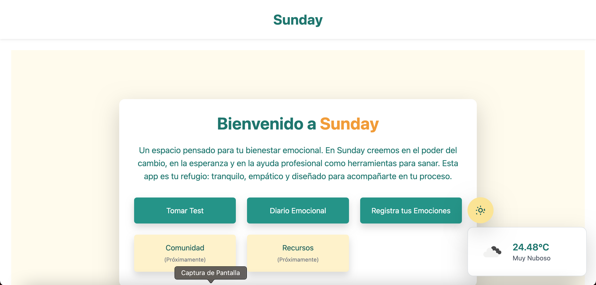

# 🌤️ Sunday – Apoyo emocional digital

<p align="center">
  
</p>


## 📌 Descripción
**Sunday** es una aplicación web diseñada para brindar apoyo a personas con problemas psicológicos.  
Permite aplicar tests para detectar posibles trastornos, registrar emociones, escribir entradas personales y conversar con un chat que simula el comportamiento de un amigo empático.

Este proyecto fue creado con un enfoque humano y técnico, combinando formularios especializados, visualización emocional y tecnología conversacional avanzada.

## ⚡ Funcionalidades
- 🧠 Aplicación de tests psicológicos con preguntas cerradas y puntuación.
- 📊 Visualización gráfica de emociones basada en respuestas del usuario.
- 💬 Chat conversacional que simula un amigo, usando Ollama y Llama 3.
- 📝 Espacio para entradas personales con fecha y hora.
- 🧼 Código limpio y estructura clara para facilitar mantenimiento.

## 🛠️ Tecnologías utilizadas
- Django `5.2`
- Ollama + Llama 3 (modelo conversacional)
- django-quill-editor `0.1.42`
- django-widget-tweaks `1.5.0`
- gunicorn `23.0.0`
- requests `2.32.4`
- sqlparse `0.5.3`
- asgiref, certifi, charset-normalizer, idna, packaging, urllib3

## ⚙️ Instalación y uso
1. Clona el repositorio:  
   ```bash
   git clone https://github.com/karina-ruiz/sunday.git
